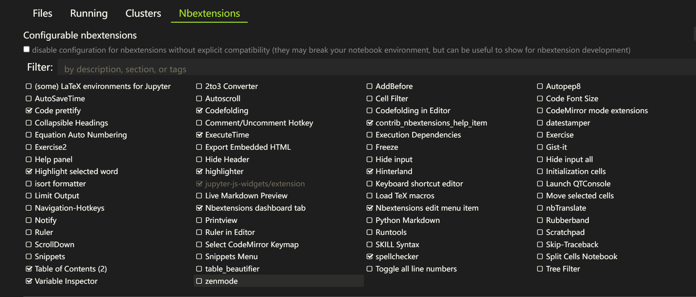
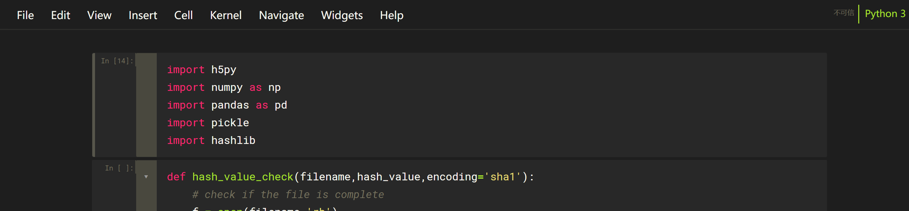

# Jupyter 的一些常见配置

### 1.背景

Jupyter 实在是太丑了，虽然只要不做demo，建议不用juypter notebook，但是我还是挺习惯用的，调试代码什么的挺方便。

所以专门记一下自己的配置，免得总是到处找。

### 2. NBExtensions

首先安装并激活 jupyter_contrib_nbextensions：

```shell
pip install -i https://pypi.tuna.tsinghua.edu.cn/simple flask
pip install jupyter_contrib_nbextensions 
jupyter contrib nbextension install --user
```

安装后启用：

```shell
pip install jupyter_nbextensions_configurator
jupyter nbextensions_configurator enable --user
```

安装完了之后，可以看到一些常见的extension，这里我直接把我的截图放上来了：

<center>



</center>

完了之后挺方便看代码的，自动补全啥的都挺方便。

### 2. Themes

Themes每次都要设置半天，很麻烦。

先安装：


```shell
# install jupyterthemes
pip install jupyterthemes
```
然后配置，找到一个我自己最喜欢的：

```shell
jt -t monokoai -f roboto -fs 14 -nfs 14 -tfs 14 -ofs 11 -cellw 80%
```

如图：

<center>



</center>

### 3. Kernels

每次都要重新配kernel，这里干脆一次记一下教程。

最简单的配置虚拟环境的方法：

```shell
# under base
conda install nb_conda
```